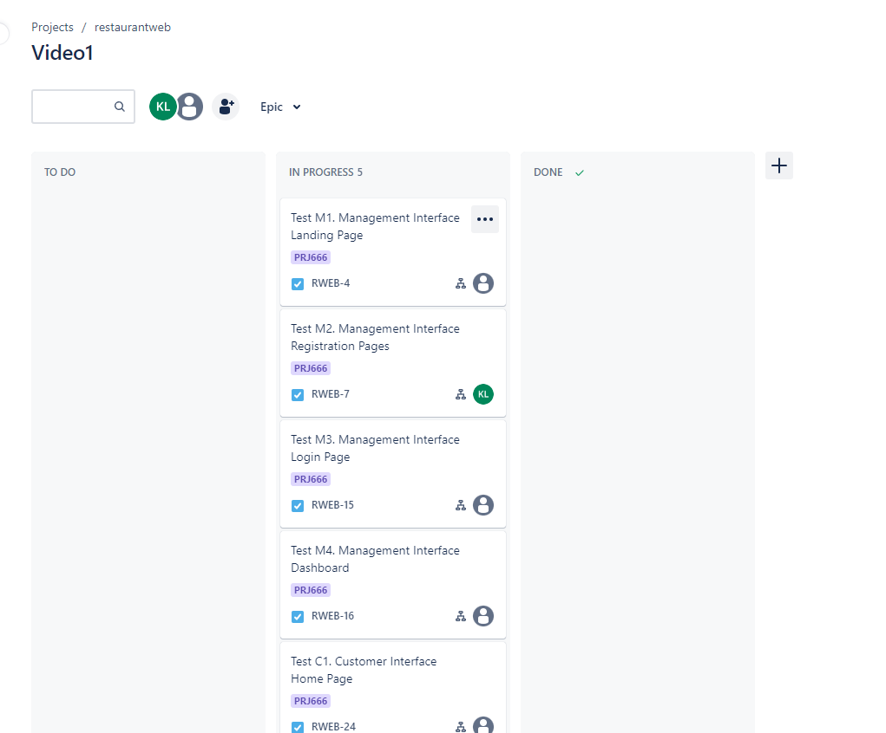
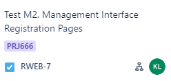
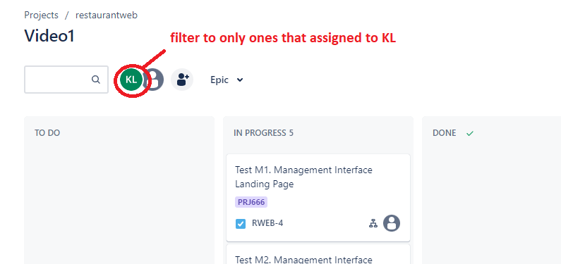
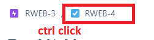
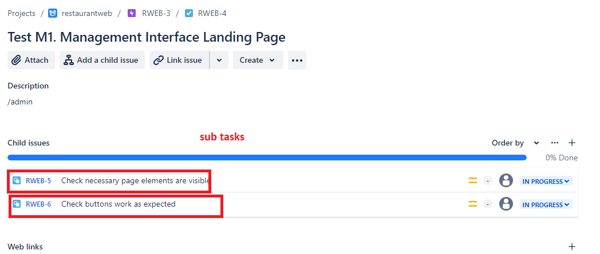
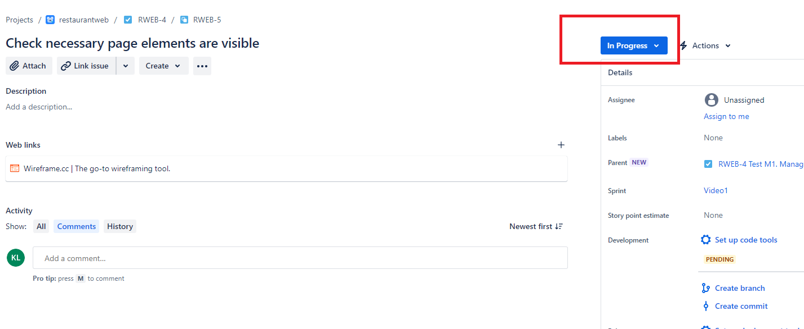

# How to view test cases and how to run test cases in JIRA

1. Tell Katie your email so she can give you access to the JIRA project where we do testing.

2. You should receive an email, follow the link to create an account.

3. Go to the link for our project's JIRA -> https://restaurantweb.atlassian.net/jira/software/projects/RWEB/boards/1

4. Test tasks that are not done are either in TO DO or IN PROGRESS column (no difference)

5. You can see who is assigned to each test case. Note the KL icon here.

6. You can do the tests that are assigned to you, or do the tests that are not assigned to anyone. You can also filter the tasks to only see the ones that are assigned to yourself.

7. Click on a test task. You will get a popup dialog. Ctrl click on the top navigation link to open it in a new tab since it is easier to work with.

8. Each test task has subtasks (most of the time). Click into the subtasks to see more details about it.

9. For each subtask test everything that is needed to test and comment that you tested everything. Attach screenshots if possible. Especially if you found a bug, definitely attach a screenshot and comment.

10. Once you commented that everything is passed, you can change the status of the task to done.

11. Once all the subtasks of a task is done, you can change the status of the task to done.
